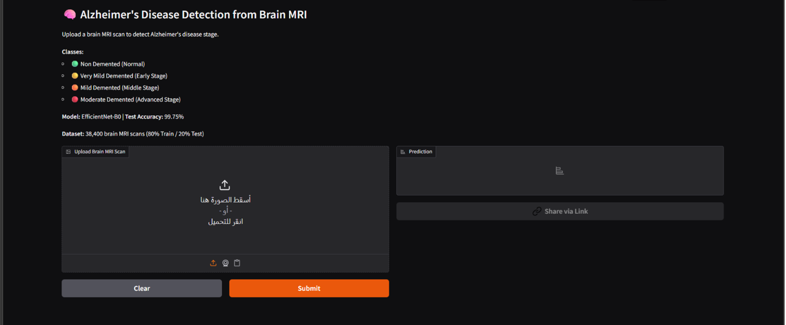
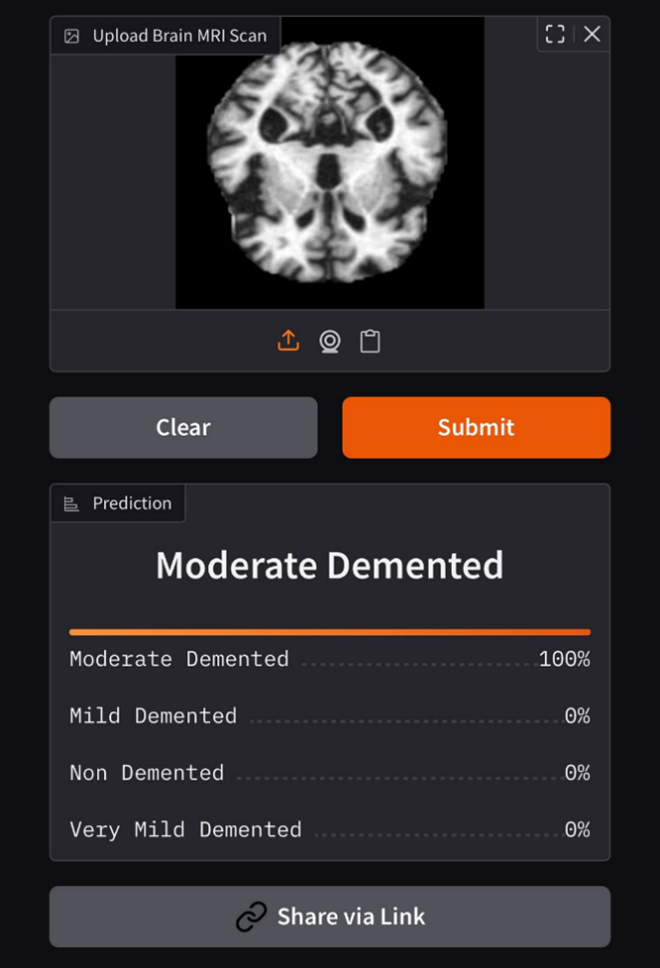

# 🧠 Alzheimer Disease Detection using Deep Learning (MRI)

## 📌 Overview

Early detection of Alzheimer’s Disease (AD) is critical for improving patient outcomes.
This project presents a deep learning–based system that classifies brain MRI scans into four stages of Alzheimer’s progression.

The system was initially developed using Jupyter Notebooks and later refactored into modular Python scripts with a simple deployment interface using Gradio.

---

## 🧪 Dataset

This project uses two MRI datasets:

* **Kaggle Dataset** (~33,984 images)
* **Mendeley Dataset** (~6,400 images, T1-weighted MRI)

### Classes:

* Non Demented
* Very Mild Demented
* Mild Demented
* Moderate Demented

> The datasets were combined and balanced to improve generalization and reduce bias.

---

## ⚙️ Approach

### 🔹 Preprocessing

* Resize images to 224x224
* Convert grayscale MRI → RGB
* Normalize using ImageNet statistics

### 🔹 Models Used

* MLP (baseline)
* ResNet-18
* EfficientNet-B0 ⭐ (best performing model)

### 🔹 Pipeline

1. Data preprocessing
2. Model training
3. Evaluation
4. Deployment using Gradio

---

## 🧠 Model

* Architecture: EfficientNet-B0
* Framework: PyTorch
* Output: 4-class classification

---

## 🚀 Demo

### 🌐 Live Web Application
You can interact with the live deployed model directly on Hugging Face Spaces:
👉 **[Alzheimer MRI Detection Live Space](https://huggingface.co/spaces/Yousef20/alzheimer-mri-detection)**


### 🖥️ Application Interface



### 📊 Example Prediction



> Note: The model file is not included due to size limitations. The demo images above show real predictions from the trained model.

---

## 🛠 Tech Stack

* Python
* PyTorch
* Torchvision
* NumPy
* OpenCV
* Gradio

---

## 📁 Project Structure

```
Alzheimer-AI/
│
├── notebooks/
│   ├── training.ipynb
│   ├── deployment.ipynb
│
├── model/
│   └── model.pth   (not included)
│
├── src/
│   ├── train.py
│   ├── predict.py
│
├── app.py
├── results/
│   ├── demo.png
│   ├── result.png
│
├── requirements.txt
└── README.md
```

---

## ▶️ How to Run

```bash
pip install -r requirements.txt
python app.py
```

---

## 💡 Key Highlights

* Multi-dataset integration
* Model comparison (MLP vs CNN vs EfficientNet)
* Medical imaging pipeline
* Deployment-ready AI application

---

## 🎯 Future Work

* Deploy as a web application (cloud)
* Add explainability (Grad-CAM)
* Improve model performance with larger datasets

---

## 👨‍💻 Author

AI Engineer focused on building real-world AI solutions combining research and production-level systems.
